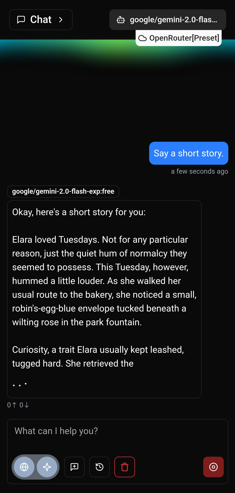
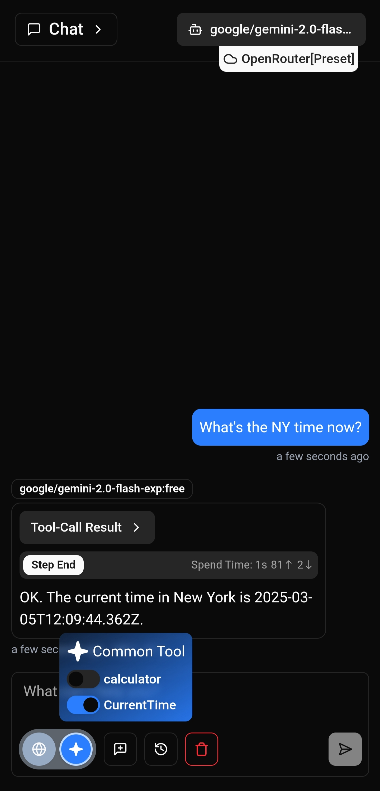

<div align="center">
    
</div>

---

# 🐯 Taiga

[](LICENSE)

## Introduction

Taiga is an open-source mobile AI chat app that supports customizing LLM providers.

> It is a work in progress project, any problem is possible, please use this premise, the author is not responsible for any form of your loss.

## Features

- **Cross-platform**: Build truly cross-platform mobile apps with Tauri, supporting Android, iOS(later).
- **High Performance**: Tauri uses Rust as the backend, providing higher performance and smaller package sizes than Electron.
- **Security**: Tauri applications have higher security by default.
- **Modern Frontend**: Build user interfaces with React and Typescript, enjoying the convenience of modern frontend development.
- **Fast Build**: Use Vite as the build tool, providing extremely fast development server startup and Hot Module Replacement (HMR).
- **Easy to Configure**: The template is pre-configured with Tauri, React, Typescript, and Vite, ready to use out of the box.
- **Internationalization**: Support multiple languages with Lingui.

### Special note about translation

All translations are from LLM. Any questions relating to translation are not intended by author, and you are welcome to provide an correction in the [issue](https://github.com/Ayuilos/taiga/issues).

## Screenshots

<div style="display: flex; gap: 16px; flex-wrap: wrap;">


</div>

### 🌟🌟 Download to explore more ⬇

## Download

Go https://github.com/Ayuilos/taiga/releases to find the latest release.

> Only Android version is available now. iOS is TBD.

## Tech Stack

- [Tauri](https://tauri.app/): A framework for building cross-platform desktop applications.
- [React](https://reactjs.org/): A JavaScript library for building user interfaces.
- [Typescript](https://www.typescriptlang.org/): A superset of JavaScript that provides static type checking.
- [Vite](https://vite.dev/): An extremely fast frontend build tool.
- [VS Code](https://code.visualstudio.com/): Recommended IDE, used with Tauri and rust-analyzer plugins.

## Quick Start

### Prerequisites

Please check https://v2.tauri.app/start/prerequisites/ first.

### Getting Started

1.  **Clone the project**:

    ```bash
    git clone https://github.com/Ayuilos/taiga.git
    cd taiga
    ```

2.  **Install dependencies**:

    ```bash
    yarn install
    ```

3.  **Start the development server**:

    ```bash
    yarn tauri android dev
    ```

4.  **Build the production version**:

    ```bash
    yarn tauri android build
    ```

## i18N

Taiga use [lingui](https://lingui.dev/) for i18N.

### How to add new words

#### In project code

```ts
// Import the `t` macro
import { t } from "@lingui/macro"

// Use `xxxString` as a suffix for better readability
const titleString = t`title`
```

#### in terminal

```bash
# lingui will auto extract the words
yarn extract
```

#### Find them in `src/locales/xx/messages.po`

```po
#: src/xxx/yyy.tsx:ccc
msgid "title"
msgstr ""
```

Add translation in `msgstr`

### !!! Be Careful

Don't run `yarn compile` after `yarn extract`. Project code use `dynamicActivate`

## Recommended IDE Setup

- [VS Code](https://code.visualstudio.com/)
- [Tauri VS Code plugin](https://marketplace.visualstudio.com/items?itemName=tauri-apps.tauri-vscode)
- [rust-analyzer VS Code plugin](https://marketplace.visualstudio.com/items?itemName=rust-lang.rust-analyzer)
- [prettier VS Code plugin](https://marketplace.visualstudio.com/items?itemName=esbenp.prettier-vscode)
- [eslint VS Code plugin](https://marketplace.visualstudio.com/items?itemName=dbaeumer.vscode-eslint)

## License

This project uses the AGPL-v3 license. For details, please refer to the [LICENSE](LICENSE) file.

## Contact

Leave your problem in https://github.com/Ayuilos/taiga/issues
